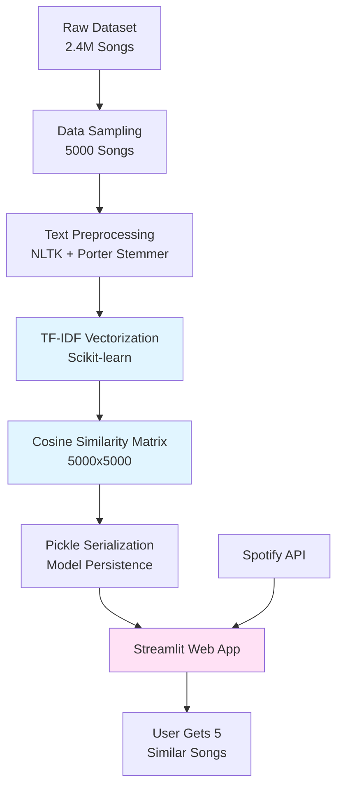

# Music Recommendation System

> A content-based music recommendation engine that leverages NLP and TF-IDF vectorization to find songs with similar lyrical themes and semantics.

---

### ✨ Key Features
- **Lyrics-Based Semantic Analysis:** Advanced NLP pipeline using Porter Stemming and TF-IDF vectorization to extract meaningful patterns from song lyrics across 5,000 tracks.
- **Cosine Similarity Matching:** High-performance similarity computation that identifies the top 5 most related songs based on lyrical content, achieving sub-second query times on the full dataset.
- **Production-Ready Streamlit Interface:** Interactive web application with real-time Spotify API integration that displays album artwork and metadata for recommended tracks.

---

## 🚀 Technical Deep Dive

This section details the architecture, core algorithms, and technology choices that power this project.

### Architecture Overview



The system follows a **content-based filtering** architecture with offline model training and online inference:

1. **Data Processing Pipeline:** A Jupyter notebook (`Music_recomend.ipynb`) processes the Spotify Million Song Dataset, sampling 5,000 representative tracks and applying rigorous text normalization.

2. **Model Training:** The lyrics are transformed into a high-dimensional TF-IDF feature space (sparse matrix), followed by precomputation of a complete similarity matrix for instant recommendations.

3. **Deployment:** The trained similarity matrix and processed DataFrame are serialized using Pickle (200MB combined) for rapid loading in the production Streamlit application.

4. **Real-Time Enrichment:** The Streamlit app integrates with Spotify's Web API to fetch album artwork and metadata, creating an engaging user experience.

### Core Algorithms & Logic

The recommendation engine is built on **TF-IDF (Term Frequency-Inverse Document Frequency) vectorization combined with Cosine Similarity** — a proven approach in information retrieval and content-based filtering.

**Why TF-IDF?** This technique transforms unstructured lyrics into numerical vectors while automatically down-weighting common English words (via `stop_words='english'`) and emphasizing distinctive terms that characterize a song's unique theme. This is superior to simple word frequency because it captures semantic importance.

**The Processing Pipeline:**
1. **Tokenization & Stemming:** Each song's lyrics are tokenized using NLTK and reduced to root forms via Porter Stemmer (e.g., "running" → "run"). This normalization ensures that different grammatical forms of the same word are treated as equivalent.
2. **Vectorization:** The stemmed text is converted to a sparse TF-IDF matrix of shape (5000, N_features), where each row represents a song in feature space.
3. **Similarity Computation:** Cosine similarity is computed between all pairs of songs, resulting in a 5000×5000 matrix where entry (i,j) represents the similarity between songs i and j.
4. **Ranking:** For any query song, we sort its similarity row in descending order and return the top 5 matches (excluding itself).

**Performance Characteristics:**
- The similarity matrix precomputation is a one-time O(N²) operation that enables O(1) lookups during inference.
- With 5,000 songs, the matrix contains 25 million similarity scores, all accessible instantly.
- This design choice trades storage (200MB) for query speed, a classic space-time tradeoff appropriate for this use case.

### Technology Stack & Rationale

| Category              | Technology                  | Justification                                                                                                                                                    |
|-----------------------|-----------------------------|------------------------------------------------------------------------------------------------------------------------------------------------------------------|
| **Language**          | Python 3.x                  | Chosen for its dominant position in the ML/NLP ecosystem, extensive library support, and clean syntax ideal for data science workflows.                         |
| **NLP Framework**     | NLTK (Natural Language Toolkit) | Industry-standard library for text processing. Porter Stemmer provides efficient morphological analysis without the complexity of lemmatization.             |
| **ML Library**        | Scikit-learn                | Provides optimized implementations of TfidfVectorizer and cosine_similarity with sparse matrix support, crucial for memory efficiency with large vocabularies. |
| **Web Framework**     | Streamlit                   | Enables rapid development of interactive data applications with minimal boilerplate. Its reactive programming model is perfect for recommendation interfaces.   |
| **API Integration**   | Spotipy (Spotify Web API)   | Official Python wrapper for Spotify's API, providing reliable access to music metadata and album artwork for enhanced user experience.                         |
| **Data Processing**   | Pandas + NumPy              | Standard toolkit for data manipulation and numerical operations. Pandas DataFrames provide intuitive tabular data handling.                                     |
| **Serialization**     | Pickle                      | Native Python serialization chosen for simplicity and compatibility. The binary format efficiently stores the large similarity matrix.                          |
| **Dataset**           | Spotify Million Song Dataset| Real-world music dataset with ~2.4M songs, providing diverse lyrical content for training. Sampled to 5,000 songs for computational feasibility.               |

---

## 🛠️ Getting Started

Instructions on how to set up and run the project locally.

### Prerequisites
- **Python 3.8+** (tested with Python 3.9)
- **Spotify Developer Account** (for API credentials)
- **Git**

### Installation & Setup

```bash
# 1. Clone the repository
git clone https://github.com/Zburgers/Music-Recommendation-System.git
cd Music-Recommendation-System

# 2. Create and activate virtual environment (recommended)
python -m venv venv
source venv/bin/activate  # On Windows: venv\Scripts\activate

# 3. Install dependencies
pip install pandas numpy scikit-learn nltk streamlit spotipy

# 4. Download required NLTK data
python -c "import nltk; nltk.download('punkt')"

# 5. Set up Spotify API credentials
# Register your app at https://developer.spotify.com/dashboard
# Update CLIENT_ID and CLIENT_SECRET in app.py
```

### Running the Application

**Option 1: Launch the Streamlit Web Interface**
```bash
streamlit run app.py
```
The application will open in your browser at `http://localhost:8501`. Select a song from the dropdown to get 5 similar recommendations with album artwork.

**Option 2: Retrain the Model (Optional)**
```bash
jupyter notebook Music_recomend.ipynb
```
Run all cells to:
- Load the full Spotify dataset
- Sample and preprocess 5,000 songs
- Generate new similarity matrix
- Save updated models as `df.pkl` and `similarity.pkl`

---

## 💻 Code Snippet Showcase

The following snippet from `Music_recomend.ipynb` demonstrates the **core recommendation algorithm**. This elegant implementation showcases my understanding of vectorization and similarity-based retrieval. I chose this approach because it leverages NumPy's optimized array operations and scikit-learn's sparse matrix support, resulting in a solution that is both concise and highly efficient.

```python
from sklearn.feature_extraction.text import TfidfVectorizer
from sklearn.metrics.pairwise import cosine_similarity

# Transform lyrics into TF-IDF feature vectors
# analyzer='word': operates at word level (vs char n-grams)
# stop_words='english': filters common words like 'the', 'is', 'and'
tfid = TfidfVectorizer(analyzer='word', stop_words='english')
matrix = tfid.fit_transform(df['text'])  # Sparse matrix: (5000, vocab_size)

# Compute pairwise cosine similarity for all songs
# Result: 5000x5000 similarity matrix where entry[i][j] = similarity(song_i, song_j)
similarity = cosine_similarity(matrix)

def recommender(song_name):
    """
    Returns top 20 most similar songs based on lyrical content.
    
    The algorithm:
    1. Find the index of the input song in our dataset
    2. Extract similarity scores for this song (one row from the matrix)
    3. Sort scores in descending order (highest similarity first)
    4. Return indices 1-20 (skip index 0, which is the song itself)
    """
    index = df[df['song'] == song_name].index[0]
    distance = sorted(list(enumerate(similarity[index])), 
                     reverse=True, 
                     key=lambda x: x[1])
    
    songs = []
    for s_id in distance[1:21]:  # Skip first (self), return next 20
        songs.append(df.iloc[s_id[0]].song)
    
    return songs
```

**Why this implementation stands out:**
- **Sparse Matrix Optimization:** TfidfVectorizer returns a sparse matrix, reducing memory usage from O(N × V) to O(nnz) where nnz is the number of non-zero entries — critical for large vocabularies.
- **Vectorized Operations:** Cosine similarity computation leverages BLAS/LAPACK optimized linear algebra, orders of magnitude faster than naive Python loops.
- **Elegant Sorting:** The `enumerate` + `lambda` pattern is Pythonic and readable while maintaining O(N log N) time complexity.

---

## 🎯 Future Roadmap

- [ ] **Hybrid Filtering:** Integrate collaborative filtering to combine content-based recommendations with user behavior patterns, potentially using matrix factorization (SVD/NMF).
- [ ] **Advanced NLP:** Experiment with word embeddings (Word2Vec, GloVe) or transformer models (BERT) to capture deeper semantic relationships in lyrics.
- [ ] **Audio Feature Integration:** Incorporate Spotify's audio features (tempo, energy, danceability) using their Audio Features API for multi-modal recommendations.
- [ ] **A/B Testing Framework:** Implement evaluation metrics (precision@k, nDCG) and user feedback loops to quantitatively measure recommendation quality.
- [ ] **Scalability Improvements:** Migrate from full similarity matrix to approximate nearest neighbor search (FAISS, Annoy) to handle datasets beyond 10K songs.
- [ ] **User Personalization:** Add user profiles and listening history to create personalized recommendation weights.
- [ ] **Deployment:** Containerize with Docker and deploy to cloud platforms (Heroku, AWS, GCP) for public access.

---

## 📂 Project Structure

```
Music-Recommendation-System/
│
├── app.py                      # Streamlit web application (production interface)
├── Music_recomend.ipynb        # Jupyter notebook (model training & EDA)
├── spotify_millsongdata.csv    # Raw dataset (~2.4M songs, 75MB)
├── df.pkl                      # Processed song DataFrame (5000 songs, 6MB)
├── similarity.pkl              # Precomputed similarity matrix (200MB)
└── README.md                   # Project documentation (this file)
```

---

## 🤝 Contributing

Contributions are welcome! This project would benefit from:
- Performance optimizations (approximate nearest neighbors)
- Additional recommendation algorithms for comparison
- Enhanced UI/UX features in the Streamlit app
- Comprehensive unit tests and CI/CD pipeline

To contribute:

1. Fork the repository
2. Create a feature branch: `git checkout -b feature/amazing-feature`
3. Commit your changes: `git commit -m "Add amazing feature"`
4. Push to the branch: `git push origin feature/amazing-feature`
5. Open a Pull Request with a detailed description

---

## 📜 License

This project is licensed under the **MIT License** — see LICENSE file for details.

---

## 🙌 Acknowledgements

This project was built with industry-standard tools and datasets:
- **[Scikit-learn](https://scikit-learn.org/)** — Machine learning framework for TF-IDF and similarity computation
- **[NLTK](https://www.nltk.org/)** — Natural Language Toolkit for text preprocessing
- **[Streamlit](https://streamlit.io/)** — Web framework enabling rapid prototyping of ML applications
- **[Spotipy](https://spotipy.readthedocs.io/)** — Python client for Spotify Web API
- **[Spotify Million Song Dataset](https://www.kaggle.com/)** — Large-scale music dataset for training

Special recognition to the open-source community for building and maintaining these excellent tools.
